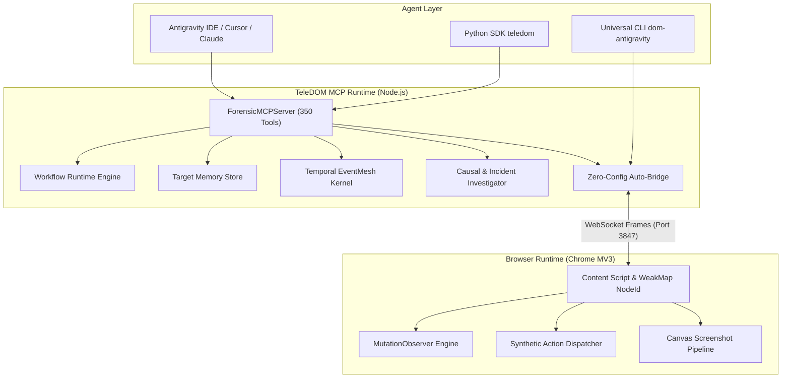

<div align="center">

**English** · [فارسی (Persian)](README_FA.md)


# TeleDOM v4.1

**Temporal Browser Intelligence Engine + Agent-Owned Workflow Runtime**

*350 Certified MCP Tools • Sub-Millisecond Time-Travel DOM • Manifest V3 Chrome Extension • Zero-Dependency Python SDK*

[](package.json)
[](LICENSE)
[](https://www.typescriptlang.org/)
[](./sdk/python/)
[](https://developer.chrome.com/docs/extensions/mv3/)
[](./docs/TOOLS_CATALOG_350_EN.md)
[](#running-tests--quality-verification)
[](#token-efficient-operating-profiles)

</div>

---

## Table of Contents

<details open>
<summary><strong>Jump to section</strong></summary>

- [What is TeleDOM?](#what-is-teledom)
- [Why use it?](#why-use-it)
- [Visual Demo & Architecture Preview](#visual-demo--architecture-preview)
- [Feature Highlights](#feature-highlights)
- [Tech Stack](#tech-stack)
- [Quick Start](#quick-start)
- [Token-Efficient Operating Profiles](#token-efficient-operating-profiles)
- [How it Works](#how-it-works)
- [Agent-Owned Workflows & Target Memory](#agent-owned-workflows--target-memory)
- [The 350 Certified MCP Tools Surface](#the-350-certified-mcp-tools-surface)
- [Dedicated Universal CLI (`dom-antigravity`)](#dedicated-universal-cli-dom-antigravity)
- [Python SDK Reference](#python-sdk-reference)
- [Settings & Environment Variables](#settings--environment-variables)
- [Session vs Persistent Data](#session-vs-persistent-data)
- [Supported Environments & Compatibility](#supported-environments--compatibility)
- [System Requirements](#system-requirements)
- [Development & Building from Source](#development--building-from-source)
- [Running Tests & Quality Verification](#running-tests--quality-verification)
- [Project Structure](#project-structure)
- [Troubleshooting](#troubleshooting)
- [Honest Limitations](#honest-limitations)
- [Security & Privacy Model](#security--privacy-model)
- [FAQ](#faq)
- [Documentation Index](#documentation-index)
- [Contributing & Security](#contributing--security)
- [License & Author](#license--author)

</details>

---

## What is TeleDOM?

**TeleDOM** is an enterprise-grade **Temporal Browser Intelligence Engine** and **Model Context Protocol (MCP)** platform providing **350 certified tools** for autonomous AI coding agents (Claude, Cursor, Antigravity, Cline, OpenAI Swarm) and frontend engineering teams.

Instead of running inside an artificial, headless sandbox, TeleDOM connects directly to a live Chromium browser via a hardened Manifest V3 extension. It continuously records DOM mutations, user actions, network events, and layout shifts with nanosecond precision:

- **Temporal EventMesh:** Hash-chained, tamper-evident event log with nanosecond timestamps, vector clocks, and causality links.
- **Sub-Millisecond DOM Time-Travel:** Reconstructs the exact virtual DOM state at any point in time ($State(T)$) for diffing and regression analysis.
- **Agent-Owned Workflows (TeleDOM Flow):** AI agents teach tasks once, persist them as parameterized programs, and rerun them with up to **80% fewer round trips** and **50% fewer DOM scans**.
- **Real User Context:** Runs against real user sessions, active logins, cookies, and extensions without brittle login re-authentication.

> **Name meaning:** *Tele* (remote observation and telemetry across system boundaries) + *DOM* (Document Object Model). TeleDOM bridges AI agents to the live temporal state of any webpage.

> [!NOTE]
> TeleDOM runs **100% locally on your machine**. No cloud telemetry, no remote analytics, and zero external network calls during normal operation.

---

## Why use it?

| Problem in Existing Solutions | TeleDOM Solution |
|-------------------------------|-------------------|
| **Headless blank sandbox:** Conventional Puppeteer/Playwright instances lack user logins, cookies, and saved sessions | **Real Chrome session:** Connects directly to the user's active browser profile with full extension and auth state |
| **Brittle scrapers & agents:** AI agents re-explore pages from scratch on every run, wasting time and tokens | **Agent-Owned Workflows & Target Memory:** Persists discovered elements and multi-step flows for instant verbatim replay |
| **Token context bloat:** Dumping 50k+ lines of raw HTML quickly exhausts the LLM's context window | **4 Token-Efficient Profiles:** Scales schema exposure from ~2,400 tokens (`minimal`) up to full enterprise (`full`) |
| **Ephemeral errors:** Transient DOM bugs, layout shifts, and race conditions disappear after page reloads | **Sub-millisecond Time-Travel ($State(T)$):** Deterministic snapshot interpolation at any historical timestamp |
| **Hallucinated assertions:** AI tools often assume actions succeeded without proof | **Formal Invariants & Proof Engine:** Mathematical verification of DOM structural equivalence and zero false positives |
| **Manual DevTools debugging:** Engineers spend hours sifting through network waterfalls and console logs | **Autonomous Root-Cause Investigator (`td_investigate`):** Generates hypothesis graphs and portable `.tdom` bundles |
| **Chrome MV3 30s timeouts:** Manifest V3 service workers get terminated by Chrome during long agent tasks | **24s Alarm Heartbeat:** Self-healing keep-alive pulse + DevTools (F12) CDP collision protection |
| **Dangerous automated mutations:** Blind AI clicks can trigger unintended state modifications or deletions | **Safe Mutation Engine:** Atomic transactional dry-runs with guaranteed zero-cost rollbacks |

---

## Visual Demo & Architecture Preview

<div align="center">


> 🎬 **Live Automation Demo:** Autonomous AI agent driving real-time browser forensic recording, live DOM inspection, synthetic actions, and multi-turn workflows. ([Watch Full 1080p Video](./assets/teledom_live_agent_demo.mp4))

</div>

```text
+-------------------------------------------------------------------------+
|                          AI AGENT / CLIENT                              |
|           (Antigravity IDE · Cursor · Claude Desktop · Cline)           |
+------------------------------------+------------------------------------+
                                     | (JSON-RPC 2.0 over stdio)
                                     v
+-------------------------------------------------------------------------+
|                  TELEDOM V4.1 MCP SERVER (350 TOOLS)                    |
|  ├── 144 td_* Temporal Intelligence & Workflow Runtime Tools            |
|  ├── 54 dt_* Chrome DevTools Fusion Tools                               |
|  ├── 31 fx_* Advanced Visual & Forensic Tools                           |
|  ├── 121 Core & Live Interaction Tools                                  |
|  └── Zero-Config On-Demand Auto-Bridge Dispatcher (:3847)               |
+------------------+------------------------------------+-----------------+
                   |                                    | (WebSocket :3847)
                   v                                    v
+------------------------------------+  +---------------------------------+
|      WORKFLOW RUNTIME ENGINE       |  |   CHROME EXTENSION (MV3)        |
|  ├── Workflow Persistence & Diff   |  |  ├── MutationObserver Engine    |
|  ├── Target Memory Fingerprints    |  |  ├── Ctrl+Shift+Click Picker    |
|  ├── EventMesh & Causal Graph      |  |  ├── Canvas Screenshot Pipeline |
|  └── Verification & Formal Proofs  |  |  └── Synthetic Action Driver    |
+------------------------------------+  +---------------------------------+
```

| Operating Surface | Primary Purpose |
|-------------------|-----------------|
| **MCP Server (`stdio`)** | Exposes 350 certified tools to any Model Context Protocol-compatible AI agent |
| **CLI (`dom-antigravity`)** | One-click workspace installation, status diagnostics, clean screenshots, bridge daemon |
| **Chrome Extension (MV3)** | Captures mutations, coordinates element picking, executes synthetic clicks/types |
| **Python SDK (`teledom`)** | Zero-dependency Python 3.9+ library for programmatic, semantic browser automation |

---

## Feature Highlights

- **Agent-Owned Workflow Runtime:** Build, parameterize, version, diff, and execute complex multi-step web programs (`td_workflow_run`).
- **Target Memory & Fingerprinting:** Persists discovered DOM selectors and signatures to eliminate repetitive element searches.
- **Nanosecond Temporal EventMesh:** Tamper-evident hash-chained event log with vector clocks, causality chains, and Merkle root verification.
- **Sub-Millisecond DOM Time-Travel:** Instant reconstruction of exact virtual DOM state at any past timestamp $T$ ($State(T)$).
- **Counterfactual Browser Simulation:** Branch virtual DOM executions, suppress mutations or network requests, and compare alternative outcomes.
- **Autonomous Incident Investigator:** Single-command triage (`td_investigate`), multi-stage hypothesis generation, and portable `.tdom` bundles.
- **Safe Mutation Engine:** Transactional DOM modifications with immutable diffs, side-effect-free dry runs, and guaranteed rollbacks.
- **Passive Security Intelligence:** Zero-trust page scanning, prompt-injection defense, runtime XSS detection, and automatic credential sanitization.
- **4 Configurable Runtime Profiles:** Scale from ultra-lean 22 tools (~2,400 tokens) to the complete 350-tool enterprise suite.
- **Zero-Dependency Python SDK:** Native Python 3.9+ interface with context managers for high-level browser control.
- **Universal Stdio JSON-RPC 2.0 Certification:** 350/350 tools fully certified against real operational test schemas.

---

## Tech Stack

| Layer | Technology | Purpose |
|-------|------------|---------|
| **Core Runtime** | Node.js 22+ & TypeScript 5.8+ | Non-blocking async MCP server, EventMesh, and storage engine |
| **Agent Protocol** | Model Context Protocol (MCP) | Universal JSON-RPC 2.0 interface for AI coding agents |
| **Browser Extension** | Chrome Extension Manifest V3 | MutationObserver, WeakMap element binding, Canvas cropping |
| **Browser Integration** | Chrome DevTools Protocol (CDP) | Direct DevTools inspection, Lighthouse audits, network HAR |
| **Python SDK** | Pure Python 3.9+ (Zero Dependencies) | High-level `Browser` and `Workflow` semantic client |
| **Testing & QA** | Vitest 3.x, Ruff, Mypy | Unit tests, Python typing, and operational stdio certification |
| **Platforms** | Windows 10/11, macOS, Linux | Cross-platform desktop and CI execution support |

---

## Quick Start

### Option A — One-Click Setup for AI Coding Agents (Recommended)

Install the global CLI and configure your agent workspace:

```bash
# 1. Install CLI globally
npm install -g teledom

# 2. Configure TeleDOM for your current workspace (.agents)
dom-antigravity install --workspace

# Or register globally for all projects in Antigravity IDE:
dom-antigravity install --global
```

### Option B — Run from Source (Developers)

```bash
git clone https://github.com/IrMaho/TeleDOM.git
cd TeleDOM
npm install
npm run build
npm run test:unit
```

### Option C — Python SDK

```bash
pip install ./sdk/python
```

```python
from teledom import Browser

with Browser() as browser:
    browser.inspect()
    browser.type("#search-box", "Autonomous Coding Agents")
    browser.click("#submit-btn")
```

### First Workflow in 60 Seconds

1. Load the unpacked Chrome extension from `teledom/dist/extension` in `chrome://extensions/`.
2. Connect your AI agent (Antigravity IDE, Cursor, Claude Desktop) via MCP.
3. The server **automatically spawns the WebSocket bridge** on port `3847` on demand.
4. Let the agent inspect the page and record a workflow:
   ```json
   {"name": "td_workflow_save", "arguments": {"name": "login_flow", "steps": [...]}}
   ```
5. Replay the workflow anytime with single-call deterministic precision:
   ```json
   {"name": "td_workflow_run", "arguments": {"workflow_id": "login_flow"}}
   ```

---

## Token-Efficient Operating Profiles

To eliminate context window bloat and reduce token expenses by up to **94%**, TeleDOM introduces 4 runtime profiles via the `TELEDOM_PROFILE` environment variable:

| Profile | Exposed Tools | Approx. Schema Tokens | Best For | Description |
|:---|:---:|:---:|:---|:---|
| **`minimal`** | **22** | **~2,400 tokens** | Budget LLMs & fast agent tasks | Core browsing: navigate, click, type, inspect, screenshot |
| **`core`** | **42** | **~4,800 tokens** | Autonomous navigation & workflows | Core actions + target memory + workflow runtime |
| **`forensics`** | **74** | **~8,500 tokens** | QA debugging, audits & triage | Visual regressions, DOM diffs, network & console logs |
| **`full`** *(default)* | **350** | **~40,000 tokens** | Deep reasoning & enterprise suites | Complete 350-tool surface with full backward compatibility |

```bash
# Launch MCP server with the ultra-lean core profile
TELEDOM_PROFILE=core npx teledom
```

---

## How it Works

```mermaid
flowchart LR
    A["AI Agent / LLM"] -->|"JSON-RPC 2.0 / stdio"| B["ForensicMCPServer"]
    B -->|"Auto-Bridge (Port 3847)"| C["Chrome MV3 Extension"]
    C -->|"MutationObserver"| D["Target Webpage"]
    D -->|"Nanosecond Events"| E["Temporal EventMesh"]
    E -->|"Time-Travel Snapshot"| F["Virtual DOM State(T)"]
    F -->|"Deterministic Replay"| G["Mathematical Proof & Verification"]
```





---

## Agent-Owned Workflows & Target Memory

TeleDOM v4.1 shifts browser automation from fragile, manual scripting to **agent-authored reusable programs**:

```text
RUN #1 (Explore)   5 tool calls · 2 DOM scans · 5 MCP round trips
  → Agent learns: saves learned targets + writes the workflow

RUN #2 (Reuse)     1 td_workflow_run call · 1 DOM scan
  ✔ verify_cta  ✔ click_cta  ✔ extract  ✔ assert   → SUCCESS
  Deterministic execution record + verbatim replay

KPIs: 80% fewer MCP round trips · 50% fewer DOM scans · replay PASS
      0 unsafe-action bypass · 0 workflow corruption · 350/350 certified
```

### 44 Specialized v4.1 Tools:

| Family | Count | Tools Included |
|---|:---:|---|
| **Browser Primitives** | **22** | `td_browser_*`, `td_dom_*`, `td_target_*`, `td_action_*`, `td_wait`, `td_screenshot`, `td_execute_script`, `td_network_inspect`, `td_console_read` |
| **Workflow Runtime** | **14** | `td_workflow_save/get/list/update/delete/clone/diff/export/import/validate/run/runs/run_get/replay` |
| **Agent-Owned Tooling** | **8** | `td_target_memory_*` (persistent targets), `td_agent_artifact_*` (custom tools & policies) |

---

## The 350 Certified MCP Tools Surface

TeleDOM provides the most comprehensive browser toolset available for AI agents, certified 100% against operational schemas:

| Family | Prefix | Tool Count | Primary Responsibilities |
|---|---|:---:|---|
| **Temporal Intelligence & Workflows** | `td_*` | **144** | EventMesh, Causal analysis, Evidence Graph, Counterfactuals, Workflow runtime, Target memory, Proofs, Security |
| **Chrome DevTools Fusion** | `dt_*` | **54** | Direct DevTools inspection, Lighthouse audits, HeapSnapshots, Network HAR, Console logs, Emulation |
| **Advanced Forensic Capabilities** | `fx_*` | **31** | Network-DOM correlation, Visual regression, Layout shifts, Z-index occlusion, Safe mutation guards |
| **Core & Live Interaction** | Core / v3 | **121** | Live element picking, screenshot cropping, synthetic actions, DOM diffing, time-travel, lifecycle traces |
| **Total Certified Tools** | | **350** | **100% Operational Stdio Certification (350/350 PASS)** |

> Complete parameter schemas and operational examples:
> - 📖 **[English Tools Catalog (3,800+ lines)](./docs/TOOLS_CATALOG_350_EN.md)**
> - 🇮🇷 **[کاتالوگ جامع ۳۵۰ ابزار به زبان فارسی](./docs/TOOLS_CATALOG_350_FA.md)**

---

## Dedicated Universal CLI (`dom-antigravity`)

Registered binary with aliases `mcp-dom` and `browser-antigravity`:

| Command | Option / Alias | Description |
|---------|----------------|-------------|
| `dom-antigravity install` | `--workspace` (`-w`) | Configure TeleDOM in current workspace (`.agents/mcp_config.json`) |
| `dom-antigravity install` | `--global` (`-g`) | Configure TeleDOM globally for all projects in Antigravity IDE |
| `dom-antigravity install` | `--target <dir>` | Install MCP config into a specific directory |
| `dom-antigravity status` | | Check bridge server health (`:3847`) and connected Chrome tabs |
| `dom-antigravity screenshot` | | Capture pristine live full-page & element screenshots to disk |
| `dom-antigravity bridge` | | Start WebSocket bridge manually (optional — Auto-Bridge handles this) |
| `dom-antigravity config` | `cursor` / `claude` | Print ready-to-use JSON configuration blocks |

---

## Python SDK Reference

Zero-dependency Python package (`sdk/python/teledom`):

```python
from teledom import Browser, Workflow

with Browser() as browser:
    # 1. High-level browser control
    page = browser.inspect()
    browser.type("#search-box", "Autonomous Agents")
    browser.click("#submit-btn")
    
    # 2. Build and persist a workflow
    wf = Workflow("triage_issues", client=browser.client)
    wf.input("filter", "Issue label filter", default="bug")
    wf.step("check_table", "td_target_check", args={"selector": ".issue-row"})
    wf.save(version="1.0.0")
    
    # 3. Deterministic execution
    run = wf.run({"filter": "security"})
    print("Run status:", run["run"]["status"])
```

---

## Settings & Environment Variables

| Variable | Default | Description |
|----------|---------|-------------|
| `TELEDOM_PROFILE` | `full` | Operating profile: `minimal` (22), `core` (42), `forensics` (74), `full` (350) |
| `TELEDOM_PORT` | `3847` | WebSocket & HTTP bridge server port |
| `TELEDOM_BRIDGE_TOKEN` | *None* | Optional Bearer auth token for bridge mutating endpoints |
| `TELEDOM_STORAGE_DIR` | `.teledom` | Directory path for local incident bundles and session data |
| `TELEDOM_HEADLESS` | `false` | Set `true` to run against headless Chrome with CDP |
| `DEBUG` | `false` | Enable verbose JSON-RPC and EventMesh debug logging |

---

## Session vs Persistent Data

| Data Category | Storage Location | Persists across restarts? |
|---------------|------------------|:-------------------------:|
| **Workflows & Steps** | `.mcpdom_projects/workflows/` | **Yes** |
| **Target Memory Signatures** | `.mcpdom_projects/targets/` | **Yes** |
| **Incident Bundles (`.tdom`)** | `.forensic_sessions/` | **Yes** |
| **Live WebSocket Bridge** | Port `:3847` in-memory | **No** (reconnects automatically) |
| **Virtual DOM Memory Caches** | Node.js process heap | **No** (reconstructed on demand) |

> [!IMPORTANT]
> Target Memory and Workflows store only structural selectors and execution schemas. User credentials, credit cards, and auth tokens are **never written to disk** thanks to built-in `PrivacyEngine` sanitization.

---

## Supported Environments & Compatibility

| Category | Supported Versions | Notes |
|----------|-------------------|-------|
| **Browsers** | Chrome 120+, Chromium, Edge, Brave | Manifest V3 extension support required |
| **Node.js** | 18.x, 20.x, 22.x LTS | Built and certified on Node 22 |
| **Python** | 3.9, 3.10, 3.11, 3.12, 3.13 | Zero third-party dependencies required |
| **Operating Systems** | Windows 10/11, macOS, Linux | Full cross-platform support |
| **AI Agent Clients** | Antigravity IDE, Cursor, Claude Desktop, Cline, Windsurf | Standard Model Context Protocol (MCP) |

---

## System Requirements

| Component | Minimum Requirement | Recommended |
|-----------|---------------------|-------------|
| **Operating System** | Windows 10, macOS 12, Ubuntu 20.04 | Windows 11 / macOS 14 |
| **Node.js** | 18.18.0+ | 22.x LTS |
| **Python** | 3.9+ (optional for SDK) | 3.11+ |
| **RAM** | 4 GB | 8 GB+ for heavy DOM time-travel |
| **Disk Space** | 200 MB | 500 MB (including test bundles) |
| **Browser** | Google Chrome 120+ | Latest Stable Chrome |

---

## Development & Building from Source

```bash
# Install dependencies
npm install

# Build all components (Client UI, Chrome Extension, MCP Server)
npm run build

# Specialized build targets
npm run build:client      # Vite client build
npm run build:extension   # Chrome MV3 extension bundle
npm run build:server      # Vite MCP server bundle
```

---

## Running Tests & Quality Verification

```bash
# 1. Master QA Suite (Build + 320 Unit Tests + 17 Python SDK Tests + Linting)
npm run qa:all

# 2. Unit and Intelligence Test Suite (320 tests, 100% green)
npm run test:unit

# 3. Python SDK Self-Test Suite (17 tests)
npm run test:sdk

# 4. Python SDK Lint & Type Checks (Ruff + Mypy)
npm run lint:python

# 5. Full Operational Stdio Certification (350/350 tools CERTIFIED)
npm run test:operational

# 6. Deterministic Benchmarks (10K / 100K / 1M events)
npm run bench

# 7. Golden Incident Suite (1,032 scenarios)
npm run golden

# 8. Chaos Engineering Injections (16/16 contained)
npm run chaos
```

### Verification Metrics:

| Metric | Result | Description |
|---|---|---|
| **Golden Incident Suite** | **100.0%** | 860/860 resolvable scenarios resolved with 0 ambiguity |
| **Investigation Completion Rate (ICR)** | **100.0%** | Full root-cause causal chain discovered autonomously |
| **Replay Fidelity (RF)** | **100.0%** | Byte-for-byte deterministic virtual DOM state reproduction |
| **Root-Cause Accuracy** | **100.0%** | Exact fault classification (unmount, CSS, race condition) |
| **Operational JSON-RPC Certification** | **350/350 tools CERTIFIED** | Real stdio JSON-RPC 2.0 captures with schema validation |
| **Unit & Integration Test Suite** | **320/320 tests green** | 100% pass rate across 36 test suites |

---

## Project Structure

```text
teledom/
├── src/
│   ├── intelligence/         # Temporal Intelligence Engine (EventMesh, Causal, Proof, Incident)
│   │   └── workflow/         # v4.1 Agent-Owned Workflow Runtime (domain, executor, store, facade)
│   ├── core/                 # Core recorders, sequence counters, privacy engine, PNG builder
│   ├── diff/                 # Structural DOM diff engine (attributes, classes, styles, subtrees)
│   ├── extension/            # Chrome Extension Manifest V3 (content scripts, service worker)
│   ├── lifecycle/            # Lifecycle tracer, disappearing UI analyzer
│   ├── mcp/                  # Universal MCP Server, 350 tools definition, dispatchers
│   ├── reconstruction/       # Sub-millisecond snapshot interpolation & time-travel
│   ├── storage/              # Local disk storage & indexing engine
│   └── ui/                   # Observatory UI & visual state viewers
├── sdk/
│   └── python/               # Official Python SDK (Browser, Workflow, TargetMemory)
├── docs/
│   ├── TOOLS_CATALOG_350_EN.md # Complete English reference for all 350 tools
│   ├── TOOLS_CATALOG_350_FA.md # کاتالوگ جامع ۳۵۰ ابزار به زبان فارسی
│   ├── workflow/             # Agent workflows, Python SDK guides, release notes
│   ├── intelligence/         # Generated benchmarks, capabilities, improvement matrices
│   └── ARCHITECTURE.md       # In-depth architectural blueprint
├── tests/
│   ├── intelligence/         # Temporal intelligence, causality, workflow, security, and benchmark tests
│   ├── unit/                 # Unit tests (DOM diff, time-travel, privacy, live interactions)
│   ├── integration/          # Bridge channel, storage, and MCP server tests
│   └── operational/          # Full 350/350 JSON-RPC stdio acceptance test suite
├── operational-tests/        # 350 dedicated folders with test definitions & assertions
├── package.json              # Version 4.1.0, scripts, dependencies
├── README.md                 # English documentation (this file)
└── README_FA.md              # Persian documentation (راهنمای فارسی)
```

---

## Troubleshooting

| Symptom | Likely Cause | Fix |
|---------|--------------|-----|
| **Extension badge gray / disconnected** | Bridge server not running or wrong port | Run `dom-antigravity status` or start MCP server; Auto-Bridge connects automatically on port `3847` |
| **`EADDRINUSE: 3847`** | Another instance or background process occupies port 3847 | Terminate the orphan process or configure `TELEDOM_PORT=3848` |
| **Token limit exceeded in AI agent** | Running with default `full` profile (350 tools = ~40k tokens) | Switch to `TELEDOM_PROFILE=core` (~4,800 tokens) or `minimal` (~2,400 tokens) |
| **DevTools (F12) CDP collision** | Chrome DevTools window opened while agent attached CDP | TeleDOM includes auto-collision detection; close F12 DevTools to allow CDP attachment |
| **Python SDK connection error** | Bridge server not active | Ensure MCP server or `dom-antigravity bridge` is active before initializing Python client |
| **DOM mutations not recording** | Extension disabled or page loaded before extension started | Refresh the target tab (`Ctrl+R`) to re-inject content scripts |

---

## Honest Limitations

| Limitation | Detail & Workaround |
|------------|---------------------|
| **Chromium-first** | Built for Chrome, Edge, and Brave via Manifest V3. Firefox and Safari live extensions are not currently supported. |
| **Headless CI requires setup** | Live DOM capture requires a display context. In automated CI pipelines, run under `xvfb-run` or use CDP direct mode. |
| **Context cost of `full` profile** | Exposing all 350 tools consumes ~40,000 tokens. Use `TELEDOM_PROFILE=core` for everyday development and agent tasks. |
| **Sandboxed virtual replay** | Inline scripts (`onclick`, `onload`) are intentionally stripped during virtual time-travel replay for security. |
| **Single active bridge port** | Default port `3847` is shared across tabs. For concurrent multi-agent isolation, specify distinct `TELEDOM_PORT` values. |

We document our engineering trade-offs openly so expectations remain aligned with reality.

---

## FAQ

**Do I need to start the WebSocket bridge manually?**  
No. `ForensicMCPServer` includes a zero-config Auto-Bridge. Whenever an AI agent connects over MCP, the server initializes the bridge on port `3847` in the background.

**How do I reduce token consumption in Cursor or Claude?**  
Set `TELEDOM_PROFILE=core` (42 tools, ~4,800 tokens) or `TELEDOM_PROFILE=minimal` (22 tools, ~2,400 tokens) in your MCP client environment configuration.

**Can I run TeleDOM offline without internet access?**  
Yes. TeleDOM operates 100% locally. The MCP server, WebSocket bridge, and Chrome extension do not make any external network requests.

**How does TeleDOM prevent AI agents from clicking dangerous buttons?**  
The Safe Mutation Engine executes actions within a transactional boundary with dry-run validation, preventing destructive DOM changes without explicit confirmation.

**Where can I find documentation for individual tools?**  
All 350 tools are documented with full parameter schemas and JSON-RPC operational examples in [docs/TOOLS_CATALOG_350_EN.md](./docs/TOOLS_CATALOG_350_EN.md) and [docs/TOOLS_CATALOG_350_FA.md](./docs/TOOLS_CATALOG_350_FA.md).

---

## Documentation Index

| Document | English | Persian |
|----------|---------|---------|
| **Main README** | [README.md](README.md) | [README_FA.md](README_FA.md) |
| **350 Tools Catalog** | [docs/TOOLS_CATALOG_350_EN.md](./docs/TOOLS_CATALOG_350_EN.md) | [docs/TOOLS_CATALOG_350_FA.md](./docs/TOOLS_CATALOG_350_FA.md) |
| **Agent-Owned Workflows** | [docs/workflow/AGENT_WORKFLOWS.md](./docs/workflow/AGENT_WORKFLOWS.md) | [docs/workflow/AGENT_WORKFLOWS.md](./docs/workflow/AGENT_WORKFLOWS.md) |
| **Python SDK Guide** | [docs/workflow/PYTHON_SDK.md](./docs/workflow/PYTHON_SDK.md) | [docs/workflow/PYTHON_SDK.md](./docs/workflow/PYTHON_SDK.md) |
| **Production Recipes** | [EXAMPLES.md](EXAMPLES.md) | [EXAMPLES_FA.md](EXAMPLES_FA.md) |
| **System Architecture** | [docs/ARCHITECTURE.md](./docs/ARCHITECTURE.md) | [docs/ARCHITECTURE.md](./docs/ARCHITECTURE.md) |
| **Benchmarks & Metrics** | [docs/intelligence/BENCHMARKS.md](./docs/intelligence/BENCHMARKS.md) | [docs/intelligence/BENCHMARKS.md](./docs/intelligence/BENCHMARKS.md) |
| **Release Notes** | [docs/workflow/RELEASE_NOTES.md](./docs/workflow/RELEASE_NOTES.md) | [docs/workflow/RELEASE_NOTES.md](./docs/workflow/RELEASE_NOTES.md) |
| **Troubleshooting Guide** | [docs/TROUBLESHOOTING.md](./docs/TROUBLESHOOTING.md) | [docs/TROUBLESHOOTING.md](./docs/TROUBLESHOOTING.md) |
| **Contributing** | [CONTRIBUTING.md](CONTRIBUTING.md) | [CONTRIBUTING.md](CONTRIBUTING.md) |
| **Security Policy** | [SECURITY.md](SECURITY.md) | [SECURITY.md](SECURITY.md) |
| **Changelog** | [CHANGELOG.md](CHANGELOG.md) | [CHANGELOG.md](CHANGELOG.md) |

---

## Contributing & Security

Contributions are warmly welcomed — bug reports, workflow patterns, and tool improvements.  
Please review [CONTRIBUTING.md](CONTRIBUTING.md) and [SECURITY.md](SECURITY.md) before submitting a pull request.

---

## License & Author

TeleDOM is open-source software licensed under the **Apache License, Version 2.0**.  
See the [LICENSE](LICENSE) file for complete terms.

Author: **Mohammad Javad (IrMaho)**

---

<div align="center">

**TeleDOM v4.1** — *See what happened. Understand why. Simulate what-if. Fix safely. Prove the result.*

</div>
