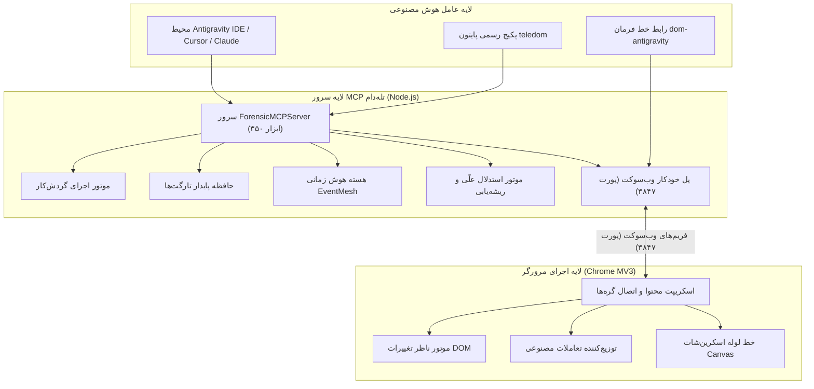

<div align="center">

[English](README.md) · **فارسی**


# تله‌دام نسخه ۴.۱ (TeleDOM v4.1)

**موتور هوش زمانی مرورگر + محیط اجرای اتوماسیون با مالکیت عامل**

*۳۵۰ ابزار اعتبارسنجی‌شده MCP • بازسازی زمان‌محور DOM زیر میلی‌ثانیه • افزونه کروم MV3 • پکیج پایتون بدون وابستگی*

[](package.json)
[](LICENSE)
[](https://www.typescriptlang.org/)
[](./sdk/python/)
[](https://developer.chrome.com/docs/extensions/mv3/)
[](./docs/TOOLS_CATALOG_350_FA.md)
[](#اجرای-تستها-و-تضمین-کیفیت)
[](#پروفایلهای-بهینه-مصرف-توکن)

</div>

---

<div dir="rtl">

## فهرست مطالب

<details open>
<summary><strong>پرش به بخش</strong></summary>

- [تله‌دام چیست؟](#تلهدام-چیست)
- [چرا استفاده کنیم؟](#چرا-استفاده-کنیم)
- [پیش‌نمایش بصری و دموی معماری](#پیشنمایش-بصری-و-دموی-معماری)
- [ویژگی‌های برجسته و کلیدی](#ویژگیهای-برجسته-و-کلیدی)
- [پشته فناوری](#پشته-فناوری)
- [شروع سریع](#شروع-سریع)
- [پروفایل‌های بهینه مصرف توکن](#پروفایلهای-بهینه-مصرف-توکن)
- [نحوه کار](#نحوه-کار)
- [گردش‌کارهای عامل‌محور و حافظه تارگت](#گردشکارهای-عامل‌محور-و-حافظه-تارگت)
- [زرادخانه ۳۵۰ ابزار استاندارد MCP](#زرادخانه-۳۵۰-ابزار-استاندارد-mcp)
- [رابط خط فرمان همگانی (`dom-antigravity`)](#رابط-خط-فرمان-همگانی-dom-antigravity)
- [مرجع کتابخانه پایتون (Python SDK)](#مرجع-کتابخانه-پایتون-python-sdk)
- [مرجع تنظیمات و متغیرهای محیطی](#مرجع-تنظیمات-و-متغیرهای-محیطی)
- [دادهٔ جلسه در مقابل دادهٔ پایدار](#دادهٔ-جلسه-در-مقابل-دادهٔ-پایدار)
- [محیط‌های پشتیبانی‌شده و جدول سازگاری](#محیطهای-پشتیبانیشده-و-جدول-سازگاری)
- [نیازمندی‌های سیستم](#نیازمندیهای-سیستم)
- [توسعه و ساخت از سورس](#توسعه-و-ساخت-از-سورس)
- [اجرای تست‌ها و تضمین کیفیت](#اجرای-تستها-و-تضمین-کیفیت)
- [ساختار مخزن پروژه](#ساختار-مخزن-پروژه)
- [عیب‌یابی و رفع اشکال](#عیبیابی-و-رفع-اشکال)
- [محدودیت‌های صادقانه](#محدودیتهای-صادقانه)
- [مدل امنیت و حریم خصوصی](#مدل-امنیت-و-حریم-خصوصی)
- [سوالات متداول (FAQ)](#سوالات-متداول-faq)
- [نمایه مستندات پروژه](#نمایه-مستندات-پروژه)
- [مشارکت و امنیت](#مشارکت-و-امنیت)
- [لایسنس و نویسنده](#لایسنس-و-نویسنده)

</details>

---

## تله‌دام چیست؟

**تله‌دام (TeleDOM)** یک موتور صنعتی **هوش زمانی مرورگر (Temporal Browser Intelligence Engine)** و پلتفرم فراگیر پروتکل کانتکست مدل (**MCP**) شامل **۳۵۰ ابزار اعتبارسنجی‌شده** است که برای عامل‌های هوش مصنوعی خودمختار (مانند Claude، Cursor، Antigravity، Cline و OpenAI Swarm) و تیم‌های مهندسی فرانت‌اند طراحی شده است.

بر خلاف مرورگرهای مصنوعی یا محیط‌های بدون‌سر (Headless)، تله‌دام از طریق یک افزونه استاندارد و مقاوم Manifest V3 مستقیماً به مرورگر واقعی و زنده کاربر متصل می‌شود و تمامی رویدادها، جهش‌های DOM، درخواست‌های شبکه و تغییرات ساختار صفحه را با دقت نانوثانیه ثبت می‌کند:

- **هسته هوش زمانی EventMesh:** زنجیره ثبت وقایع غیرقابل‌دستکاری همراه با مهرهای زمانی نانوثانیه، ساعت‌های برداری و ردیابی علّی پیوندها.
- **سفر در زمان DOM زیر میلی‌ثانیه:** بازسازی کامل و بایت‌به‌بایت درخت مجازی DOM در هر لحظه دلخواه از گذشته ($State(T)$) جهت استخراج تفاضل‌ها و تحلیل رگرسیون.
- **گردش‌کارهای با مالکیت عامل (TeleDOM Flow):** عامل هوش مصنوعی فرآیند را یک‌بار یاد می‌گیرد، به شکل یک برنامه پارامتریک پایدار ذخیره می‌کند و در دفعات بعد با **۸۰٪ کاهش رفت‌وبرگشت MCP** و **۵۰٪ کاهش اسکن DOM** آن را به صورت قطعی اجرا می‌نماید.
- **زمینه واقعی کاربر:** دسترسی مستقیم به سشن‌های لاگین فعال، کوکی‌ها، افزونه‌ها و نشست‌های کاری کاربر بدون نیاز به ورود مجدد اطلاعات حساس.

> **وجه تسمیه:** نام *TeleDOM* از ترکیب *Tele* (تله‌متری و رصد از راه دور فراسوی مرزهای سیستم) و *DOM* (درخت ساختاری صفحات وب) پدید آمده است.

> [!NOTE]
> تله‌دام **۱۰۰٪ به صورت محلی و آفلاین** روی رایانه شما اجرا می‌شود. این سیستم هیچ‌گونه دیتای تله‌متری، ارسال ابری یا اتصال به سرورهای خارجی در عملکرد عادی خود ندارد.

---

## چرا استفاده کنیم؟

| چالش در راهکارهای موجود | پاسخ مهندسی تله‌دام (TeleDOM) |
|-------------------------|-----------------------------|
| **محیط خام و بدون سشن:** مرورگرهای سنتی Puppeteer/Playwright فاقد سشن‌های لاگین، کوکی‌ها و زمینه واقعی کاربر هستند | **سشن واقعی کروم:** اتصال زنده به پروفایل فعال مرورگر کاربر همراه با دسترسی کامل به سشن‌ها و کوکی‌ها |
| **اسکرپرهای شکننده و پرهزینه:** عامل‌های AI در هر بار اجرا صفحه را از صفر اسکن می‌کنند که موجب هدررفت توکن می‌شود | **گردش‌کار عامل‌محور و حافظه المان‌ها:** ذخیره ردپای تارگت‌ها و بازپخش آنی، قطعی و بایت‌به‌بایت بدون نیاز به اسکن مجدد |
| **انفجار مصرف توکن مدل‌های زبانی:** ارسال کدهای خام ۵۰ هزار خطی HTML پنجره کانتکست مدل را فوراً پر می‌کند | **۴ پروفایل مصرف بهینه:** مقیاس‌بندی هوشمند اسکیما از ۲,۴۰۰ توکن (`minimal`) تا سطح کامل سازمانی (`full`) |
| **خطاهای زودگذر و ناپدیدشونده:** خطاهای استایل، جابه‌جایی‌های چیدمان و Race Conditionها با رفرش صفحه گم می‌شوند | **سفر در زمان زیر میلی‌ثانیه‌ای ($State(T)$):** بازسازی دقیق وضعیت DOM در هر لحظه دلخواه از خط زمانی |
| **ادعاهای توهم‌آمیز بدون اثبات:** ربات‌های تست ادعا می‌کنند که اکشن‌ها موفق بوده‌اند اما سندی وجود ندارد | **موتور اثبات و نامتغیرها:** راستی‌آزمایی ریاضی هم‌ارزی ساختاری DOM و تضمین صفر درصد مثبت کاذب |
| **دیباگ دستی و زمان‌بر در کنسول:** مهندسان ساعت‌ها وقت خود را صرف بررسی لاگ‌های شبکه و کنسول می‌کنند | **بازرس خودکار علت ریشه‌ای (`td_investigate`):** تولید خودکار گراف فرضیات علّی و فایل‌های بسته حادثه `.tdom` |
| **تایم‌اوت ۳۰ ثانیه‌ای کروم MV3:** سرویس‌ورکر افزونه در تسک‌های طولانی‌مدت توسط کروم خاموش می‌شود | **ضربان قلب آلارم ۲۴ ثانیه‌ای:** احیای مداوم ارتباط + محافظت از تداخل DevTools (F12) با پروتکل CDP |
| **اکشن‌های مخرب و غیرقابل‌برگشت:** کلیک‌های نادانسته عامل ممکن است داده‌های مهم را حذف یا دستکاری کند | **موتور جهش امن:** اجرای ترانزاکشنال اتمیک همراه با پیش‌نمایش کاملاً بدون اثر (Dry-run) و بازگشت قطعی |

---

## پیش‌نمایش بصری و دموی معماری

<div align="center">


> 🎬 **دموی ویدیویی زنده:** اجرای خودکار عامل هوش مصنوعی برای ضبط رخدادهای مرورگر، بازرسی درخت DOM، انجام تعاملات و اجرای چندمرحله‌ای اتوماسیون وب بدون دخالت دست! ([مشاهده و دانلود ویدیو 1080p](./assets/teledom_live_agent_demo.mp4))

</div>

```text
+-------------------------------------------------------------------------+
|                        عامل هوش مصنوعی / کلاینت                         |
|           (Antigravity IDE · Cursor · Claude Desktop · Cline)           |
+------------------------------------+------------------------------------+
                                     | (ارتباط JSON-RPC 2.0 روی stdio)
                                     v
+-------------------------------------------------------------------------+
|                  سرور جامع تله‌دام نسخه ۴.۱ (۳۵۰ ابزار)                  |
|  ├── ۱۴۴ ابزار هوش زمانی، گردش‌کار و حافظه عامل td_*                     |
|  ├── ۵۴ ابزار تلفیق DevTools کروم dt_*                                 |
|  ├── ۳۱ ابزار کالبدشکافی پیشرفته بصری fx_*                             |
|  ├── ۱۲۱ ابزار پایه، بازرسی زنده و تعامل                                |
|  └── توزیع‌کننده پل ارتباطی خودکار روی پورت ۳۸۴۷                        |
+------------------+------------------------------------+-----------------+
                   |                                    | (وب‌سوکت :3847)
                   v                                    v
+------------------------------------+  +---------------------------------+
|        موتور اجرای گردش‌کار        |  |     افزونه کروم (Manifest V3)   |
|  ├── ذخیره‌سازی و تفاضل ورک‌فلوها  |  |  ├── موتور ناظر تغییرات DOM     |
|  ├── حافظه مشخصات پایدار المان‌ها  |  |  ├── انتخابگر بصری المان‌ها    |
|  ├── هسته EventMesh و گراف علّی    |  |  ├── خط لوله اسکرین‌شات تمیز     |
|  └── موتور اثبات و نامتغیرها       |  |  └── درایور تعاملات شبیه‌سازی‌شده|
+------------------------------------+  +---------------------------------+
```

| سطح عملیاتی | هدف و کاربرد اصلی |
|-------------|-------------------|
| **سرور MCP (`stdio`)** | ارائه ۳۵۰ ابزار اعتبارسنجی‌شده به کلیه کلاینت‌های سازگار با استاندارد Model Context Protocol |
| **خط فرمان (`dom-antigravity`)** | پیکربندی یک‌کلیکه ورک‌اسپیس‌ها، بررسی سلامت سیستم، ثبت اسکرین‌شات تمیز و مدیریت دیمن بریج |
| **افزونه کروم (MV3)** | رهگیری جهش‌های صفحه، تسهیل انتخاب المان با کلید ترکیبی، اجرای کلیک و تایپ شبیه‌سازی‌شده |
| **کتابخانه پایتون (`teledom`)** | پکیج خالص پایتون ۳.۹+ بدون هیچ وابستگی خارجی جهت برنامه‌نویسی سطح بالای معنایی مرورگر |

---

## ویژگی‌های برجسته و کلیدی

- **محیط اجرای گردش‌کار با مالکیت عامل:** ساخت، پارامتریک‌سازی، نسخه‌بندی، مقایسه تفاوت‌ها و بازپخش قطعی برنامه‌های چندمرحله‌ای مرورگر (`td_workflow_run`).
- **حافظه المان‌ها و اثرانگشت ساختاری:** ذخیره پایدار سلکتورها و هویت المان‌ها جهت رفع نیاز به اسکن‌های مکرر و خسته‌کننده صفحه.
- **هسته EventMesh زمانی با دقت نانوثانیه:** لاگ وقایع غیرقابل‌دستکاری با زنجیره هش SHA-256، ساعت‌های برداری و ریشه‌های درخت مرکل.
- **سفر در زمان DOM زیر میلی‌ثانیه‌ای:** بازسازی لحظه‌ای وضعیت DOM در هر مهر زمانی گذشته ($State(T)$).
- **شبیه‌سازی مرورگر خلاف‌واقع (Counterfactual):** انشعاب‌گیری فرضی از وضعیت DOM، فیلتر کردن رخدادها یا درخواست‌ها و مقایسه پیامدهای احتمالی.
- **کارآگاه خودکار حوادث (`td_investigate`):** تریاژ خودکار تنها با یک دستور، فرمول‌بندی فرضیات علّی و تولید پکیج‌های حادثه `.tdom`.
- **موتور جهش امن (Safe Mutation):** اعمال اتمیک و ترانزاکشنال تغییرات با امکان پیش‌نمایش بی‌خطر (Dry-run) و بازگشت تضمینی.
- **هوش امنیتی منفعل (Passive Security):** مانیتورینگ بدون‌توقف صفحه، مقابله با تزریق پرامپت، کشف XSS و سانسور داده‌های حساس.
- **۴ پروفایل مصرف بهینه توکن:** مدیریت هوشمند پنجره کانتکست از ۲۲ ابزار فوق‌سریع (~۲,۴۰۰ توکن) تا زرادخانه کامل ۳۵۰ ابزار.
- **کتابخانه رسمی پایتون با صفر وابستگی:** کنترل سطح‌بالای مرورگر در پایتون ۳.۹+ با استفاده از ساختار کانتکست منیجر.
- **اعتبارسنجی ۱۰۰٪ عملیاتی پروتکل JSON-RPC:** تایید کامل ۳۵۰ ابزار از ۳۵۰ ابزار روی کانال ارتباطی واقعی stdio.

---

## پشته فناوری

| لایه | فناوری | کاربرد در سیستم |
|------|--------|-----------------|
| **هسته و ران‌تایم** | Node.js 22+ & TypeScript 5.8+ | سرور غیرمسدودکننده MCP، هسته EventMesh و سیستم فایلینگ |
| **پروتکل عامل هوش مصنوعی** | Model Context Protocol (MCP) | استاندارد ارتباطی JSON-RPC 2.0 برای تمامی عامل‌های هوش مصنوعی |
| **اکستنشن مرورگر** | Chrome Extension Manifest V3 | ثبت جهش‌ها با MutationObserver، اتصال گره‌ها با WeakMap |
| **یکپارچگی مرورگر** | Chrome DevTools Protocol (CDP) | ممیزی Lighthouse، تحلیل HAR شبکه و ارزیابی عمیق کارایی |
| **پکیج پایتون** | Pure Python 3.9+ (Zero-Dependency) | کلاینت سطح‌بالای معنایی شامل `Browser` و `Workflow` |
| **تست و ارزیابی کیفیت** | Vitest 3.x, Ruff, Mypy | تست‌های واحد، سازگاری تایپ‌ها و سوئیت اعتبارسنجی stdio |
| **پلتفرم‌های مقصد** | Windows 10/11, macOS, Linux | پشتیبانی همه‌جانبه از تمام سیستم‌عامل‌های رومیزی و CI |

---

## شروع سریع

### مسیر الف — راه‌اندازی با یک کلیک برای عامل‌های هوش مصنوعی (پیشنهادی)

نصب ابزار خط فرمان و فعال‌سازی تله‌دام برای ورک‌اسپیس یا سیستم:

```bash
# ۱. نصب باینری سراسری
npm install -g teledom

# ۲. پیکربندی تله‌دام برای پروژه فعلی (.agents)
dom-antigravity install --workspace

# یا پیکربندی سراسری برای تمام پروژه‌های Antigravity IDE:
dom-antigravity install --global
```

### مسیر ب — اجرای پروژه از سورس (توسعه‌دهندگان)

```bash
git clone https://github.com/IrMaho/TeleDOM.git
cd TeleDOM
npm install
npm run build
npm run test:unit
```

### مسیر ج — استفاده در پایتون (Python SDK)

```bash
pip install ./sdk/python
```

```python
from teledom import Browser

with Browser() as browser:
    browser.inspect()
    browser.type("#search-box", "عامل‌های خودمختار هوش مصنوعی")
    browser.click("#submit-btn")
```

### اولین اتوماسیون در ۶۰ ثانیه

۱. پوشه `teledom/dist/extension` را به عنوان افزونه بازشده (Unpacked) در `chrome://extensions/` لود کنید.
۲. عامل هوش مصنوعی خود (Antigravity IDE، Cursor یا Claude Desktop) را متصل نمایید.
۳. سرور **پل وب‌سوکت را به‌صورت خودکار** روی پورت `۳۸۴۷` فعال می‌کند.
۴. از عامل بخواهید صفحه را بازرسی کرده و گردش‌کار را ذخیره کند:
   ```json
   {"name": "td_workflow_save", "arguments": {"name": "login_flow", "steps": [...]}}
   ```
۵. این گردش‌کار را در هر زمان با یک فراخوانی قطعی بازپخش کنید:
   ```json
   {"name": "td_workflow_run", "arguments": {"workflow_id": "login_flow"}}
   ```

---

## پروفایل‌های بهینه مصرف توکن

برای جلوگیری از هدررفت کانتکست مدل‌های زبانی و کاهش هزینه‌های پردازش تا **۹۴٪**، تله‌دام ۴ پروفایل اجرایی از طریق متغیر محیطی `TELEDOM_PROFILE` ارائه می‌دهد:

| پروفایل | ابزارهای فعال | توکن تخمینی اسکیما | کاربرد ایده‌آل | توضیحات |
|:---|:---:|:---:|:---|:---|
| **`minimal`** | **۲۲** | **حدود ۲,۴۰۰ توکن** | پاسخ‌های سریع و مدل‌های کم‌هزینه | عملیات پایه ناوبری: بازرسی، کلیک، تایپ، اسکرین‌شات |
| **`core`** | **۴۲** | **حدود ۴,۸۰۰ توکن** | اتوماسیون کامل و پایدار | ابزارهای اصلی + حافظه تارگت‌ها + موتور اجرای گردش‌کار |
| **`forensics`** | **۷۴** | **حدود ۸,۵۰۰ توکن** | ممیزی، خطایابی و تست‌های QA | تحلیل رگرسیون دیداری، تفاضل DOM، لاگ‌های شبکه و کنسول |
| **`full`** *(پیش‌فرض)* | **۳۵۰** | **حدود ۴۰,۰۰۰ توکن** | استدلال عمیق و نیازهای سازمانی | زرادخانه کامل ۳۵۰ ابزار با سازگاری کامل با نسخه‌های قبل |

```bash
# اجرای سرور با پروفایل سبک Core
TELEDOM_PROFILE=core npx teledom
```

---

## نحوه کار

```mermaid
flowchart LR
    A["عامل هوش مصنوعی / LLM"] -->|"ارتباط JSON-RPC 2.0 / stdio"| B["سرور ForensicMCPServer"]
    B -->|"پل خودکار (پورت ۳۸۴۷)"| C["افزونه کروم MV3"]
    C -->|"MutationObserver"| D["صفحه وب هدف"]
    D -->|"رویدادهای نانوثانیه"| E["هسته EventMesh زمانی"]
    E -->|"اسنپ‌شات سفر در زمان"| F["وضعیت مجازی DOM در لحظه T"]
    F -->|"بازپخش قطعی"| G["اثبات ریاضی و اعتبارسنجی"]
```





---

## گردش‌کارهای عامل‌محور و حافظه تارگت

تله‌دام نسخه ۴.۱ مفهوم اتوماسیون مرورگر را از اسکریپت‌نویسی سنتی به **برنامه‌های با قابلیت بازپخش با مالکیت عامل** تغییر می‌دهد:

```text
اجرای اول (کشف صفحه): ۵ فراخوانی ابزار · ۲ اسکن کامل DOM · ۵ رفت‌وبرگشت به MCP
  ← عامل یاد می‌گیرد: تارگت‌های پایدار را ذخیره کرده و ورک‌فلو را می‌نویسد.

اجرای دوم (بازپخش): تنها ۱ فراخوانی td_workflow_run · ۱ اسکن DOM
  ✔ بررسی دکمه  ✔ کلیک  ✔ استخراج داده  ✔ راستی‌آزمایی  → موفقیت ۱۰۰٪
  ثبت گزارش قطعی اجرای عملیات با قابلیت بازپخش مو‌به‌مو

شاخص‌های عملکردی: ۸۰٪ کاهش رفت‌وبرگشت MCP · ۵۰٪ کاهش اسکن DOM · بازپخش موفق
                  صفر درصد بای‌پس ناخواسته · صفر درصد تداخل · ۳۵۰/۳۵۰ ابزار تاییدشده
```

### ۴۴ ابزار تخصصی اضافه شده در نسخه ۴.۱:

| دسته‌بندی ابزارها | تعداد | ابزارهای موجود |
|---|:---:|---|
| **ابزارهای پایه مرورگر** | **۲۲** | `td_browser_*` · `td_dom_*` · `td_target_*` · `td_action_*` · `td_wait` · `td_screenshot` · `td_execute_script` · `td_network_inspect` · `td_console_read` |
| **محیط اجرای گردش‌کار** | **۱۴** | `td_workflow_save/get/list/update/delete/clone/diff/export/import/validate/run/runs/run_get/replay` |
| **ابزارها و حافظه اختصاصی عامل** | **۸** | `td_target_memory_*` (تارگت‌های پایدار) · `td_agent_artifact_*` (ابزارها و سیاست‌های سفارشی) |

---

## زرادخانه ۳۵۰ ابزار استاندارد MCP

تله‌دام دارای جامع‌ترین جعبه‌ابزار مرورگر برای عامل‌های هوش مصنوعی با تاییدیه ۱۰۰٪ عملیاتی است:

| خانواده ابزار | پیشوند | تعداد ابزار | وظایف و قابلیت‌های اصلی |
|---|---|:---:|---|
| **هوش زمانی و گردش‌کار** | `td_*` | **۱۴۴** | هسته EventMesh، تحلیل علّی، گراف شواهد، سناریوهای شرطی، گردش‌کارها، حافظه المان‌ها، اثبات‌ها و امنیت |
| **تلفیق DevTools کروم** | `dt_*` | **۵۴** | بازرسی مستقیم کلاینت کروم، ممیزی Lighthouse، ثبت HeapSnapshot، ردیابی HAR شبکه، لاگ‌های کنسول |
| **کالبدشکافی پیشرفته بصری** | `fx_*` | **۳۱** | پیوند رخدادهای شبکه با DOM، رگرسیون دیداری، جابه‌جایی چیدمان، تداخل Z-index، گارد جهش امن |
| **ابزارهای پایه و تعامل زنده** | Core / v3 | **۱۲۱** | انتخابگر بصری المان‌ها، برش اسکرین‌شات، تعاملات شبیه‌سازی‌شده، مقایسه ساختاری DOM، سفر در زمان |
| **مجموع کل ابزارهای تاییدشده** | | **۳۵۰** | **تاییدیه عملیاتی ۱۰۰٪ روی کانال stdio (پاس شدن ۳۵۰/۳۵۰)** |

> جهت مشاهده کاتالوگ تفصیلی، اسکیماهای کامل و نمونه‌های فراخوانی:
> - 🇮🇷 **[کاتالوگ جامع ۳۵۰ ابزار به زبان فارسی](./docs/TOOLS_CATALOG_350_FA.md)**
> - 📖 **[English Tools Catalog (3,800+ lines)](./docs/TOOLS_CATALOG_350_EN.md)**

---

## رابط خط فرمان همگانی (`dom-antigravity`)

باینری ثبت‌شده سیستم با نام‌های مستعار `mcp-dom` و `browser-antigravity`:

| دستور | گزینه / نام مستعار | توضیحات و عملکرد |
|-------|--------------------|-------------------|
| `dom-antigravity install` | `--workspace` (`-w`) | پیکربندی خودکار تله‌دام در پروژه جاری (`.agents/mcp_config.json`) |
| `dom-antigravity install` | `--global` (`-g`) | ثبت سراسری تله‌دام برای تمامی پروژه‌ها در Antigravity IDE |
| `dom-antigravity install` | `--target <dir>` | نصب تنظیمات در یک پوشه یا ورک‌اسپیس دلخواه |
| `dom-antigravity status` | | بررسی سلامت سرور پل ارتباطی (`:3847`) و تب‌های فعال کروم |
| `dom-antigravity screenshot` | | ثبت اسکرین‌شات تمیز از صفحه کامل و المان‌های بریده‌شده روی دیسک |
| `dom-antigravity bridge` | | اجرای دستی پل وب‌سوکت (اختیاری — پل خودکار این کار را مدیریت می‌کند) |
| `dom-antigravity config` | `cursor` / `claude` | چاپ بلاک تنظیمات JSON آماده برای استفاده در کلاینت‌های مختلف |

---

## مرجع کتابخانه پایتون (Python SDK)

کتابخانه رسمی پایتون با وابستگی صفر (`sdk/python/teledom`):

```python
from teledom import Browser, Workflow

with Browser() as browser:
    # ۱. کنترل سطح بالای مرورگر
    page = browser.inspect()
    browser.type("#search-box", "عامل‌های خودمختار هوش مصنوعی")
    browser.click("#submit-btn")
    
    # ۲. ساخت و ذخیره یک گردش‌کار اختصاصی
    wf = Workflow("triage_issues", client=browser.client)
    wf.input("filter", "فیلتر برچسب ایشوها", default="bug")
    wf.step("check_table", "td_target_check", args={"selector": ".issue-row"})
    wf.save(version="1.0.0")
    
    # ۳. اجرای قطعی با گزارش وضعیت
    run = wf.run({"filter": "security"})
    print("وضعیت اجرا:", run["run"]["status"])
```

---

## مرجع تنظیمات و متغیرهای محیطی

| متغیر محیطی | مقدار پیش‌فرض | توضیحات |
|-------------|---------------|---------|
| `TELEDOM_PROFILE` | `full` | پروفایل عملیاتی: `minimal` (۲۲), `core` (۴۲), `forensics` (۷۴), `full` (۳۵۰) |
| `TELEDOM_PORT` | `3847` | پورت ارتباطی سرور پل وب‌سوکت و HTTP |
| `TELEDOM_BRIDGE_TOKEN` | *تعریف‌نشده* | توکن امنیتی اختیاری Bearer برای محافظت از اندپوینت‌های حساس |
| `TELEDOM_STORAGE_DIR` | `.teledom` | مسیر پوشه ذخیره‌سازی محلی سشن‌ها و بسته‌های حادثه |
| `TELEDOM_HEADLESS` | `false` | تنظیم روی `true` جهت اتصال به کروم Headless با پروتکل CDP |
| `DEBUG` | `false` | فعال‌سازی لاگ‌های جزئی JSON-RPC و رخدادهای EventMesh |

---

## دادهٔ جلسه در مقابل دادهٔ پایدار

| نوع داده | محل نگهداری | ماندگاری پس از ریستارت؟ |
|----------|-------------|:----------------------:|
| **ورک‌فلوها و گام‌های اجرایی** | `.mcpdom_projects/workflows/` | **بله** |
| **اثرانگشت و حافظه المان‌ها** | `.mcpdom_projects/targets/` | **بله** |
| **پرونده‌های حادثه (`.tdom`)** | `.forensic_sessions/` | **بله** |
| **اتصال زنده پل وب‌سوکت** | حافظه رم در پورت `:3847` | **خیر** (اتصال خودکار مجدد) |
| **کش موقت اسنپ‌شات‌های مجازی** | حافظه هیپ فرآیند Node.js | **خیر** (بازسازی در صورت تقاضا) |

> [!IMPORTANT]
> در حافظه تارگت‌ها و فایل‌های گردش‌کار، صرفاً سلکتورها و اسکیماهای ساختاری ذخیره می‌شوند. رمزهای عبور کاربران، اطلاعات کارت‌های بانکی و کلیدهای دسترسی به لطف ماژول `PrivacyEngine` **هرگز روی دیسک نوشته نمی‌شوند**.

---

## محیط‌های پشتیبانی‌شده و جدول سازگاری

| دسته‌بندی | نسخه‌های پشتیبانی‌شده | نکات |
|-----------|-----------------------|------|
| **مرورگرها** | کروم ۱۲۰ به بعد، Chromium، مایکروسافت Edge، بریو (Brave) | نیازمند پشتیبانی از اکستنشن Manifest V3 |
| **ران‌تایم نود** | Node.js نسخه‌های 18.x, 20.x, 22.x LTS | کامپایل و اعتبارسنجی‌شده روی Node 22 |
| **محیط پایتون** | Python نسخه‌های 3.9, 3.10, 3.11, 3.12, 3.13 | بدون نیاز به نصب هرگونه کتابخانه متفرقه |
| **سیستم‌عامل‌ها** | ویندوز 10/11، سیستم‌عامل macOS، توزیع‌های مختلف لینوکس | پشتیبانی کامل دسکتاپ و سرور |
| **کلاینت‌های هوش مصنوعی** | Antigravity IDE، Cursor، Claude Desktop، Cline، Windsurf | سازگاری کامل با استاندارد Model Context Protocol |

---

## نیازمندی‌های سیستم

| مولفه | حداقل نیازمندی | مقدار پیشنهادی |
|-------|----------------|----------------|
| **سیستم‌عامل** | ویندوز 10، مک‌او‌اس 12، اوبونتو 20.04 | ویندوز 11 / مک‌او‌اس 14 |
| **Node.js** | 18.18.0 به بالا | 22.x LTS |
| **Python** | 3.9 به بالا (جهت پکیج پایتون) | 3.11 به بالا |
| **حافظه رم (RAM)** | ۴ گیگابایت | ۸ گیگابایت به بالا برای تحلیل سنگین DOM |
| **فضای دیسک** | ۲۰۰ مگابایت | ۵۰۰ مگابایت (شامل فایل‌های آزمون) |
| **مرورگر** | Google Chrome 120+ | آخرین نسخه پایدار Google Chrome |

---

## توسعه و ساخت از سورس

```bash
# نصب وابستگی‌ها
npm install

# کامپایل تمام بخش‌ها (کلاینت، افزونه کروم، سرور MCP)
npm run build

# ساخت اختصاصی هر بخش
npm run build:client      # کامپایل کلاینت با Vite
npm run build:extension   # باندل افزونه کروم MV3
npm run build:server      # کامپایل سرور MCP
```

---

## اجرای تست‌ها و تضمین کیفیت

```bash
# ۱. سوئیت آزمون جامع مهندسی (بیلد + ۳۲۰ تست واحد + ۱۷ تست پایتون + لینت)
npm run qa:all

# ۲. اجرای آزمون‌های واحد و هوش زمانی (۳۲۰ تست، ۱۰۰٪ سبز)
npm run test:unit

# ۳. اجرای تست‌های پکیج پایتون (۱۷ تست)
npm run test:sdk

# ۴. اعتبارسنجی کدهای پایتون و سازگاری تایپ‌ها (Ruff + Mypy)
npm run lint:python

# ۵. آزمون عملیاتی تاییدیه تمامی ۳۵۰ ابزار روی کانال stdio (تاییدیه ۱۰۰٪)
npm run test:operational

# ۶. اجرای بنچمارک‌های قطعی (۱۰ هزار، ۱۰۰ هزار و ۱ میلیون رویداد)
npm run bench

# ۷. اجرای مجموعه آزمون‌های حوادث طلایی (۱,۰۳۲ سناریو)
npm run golden

# ۸. اجرای آزمون‌های مهندسی آشوب و تزریق خطا (۱۶ از ۱۶ مهارشده)
npm run chaos
```

### سنجه‌های اعتبارسنجی سنجیده‌شده:

| سنجه | نتیجه | توضیح |
|---|---|---|
| **مجموعه حوادث طلایی** | **۱۰۰.۰٪** | حل کامل ۸۶۰ سناریوی قابل‌حل بدون هیچ‌گونه ابهام |
| **نرخ تکمیل بررسی ریشه خطا (ICR)** | **۱۰۰.۰٪** | کشف خودکار و گام‌به‌گام زنجیره علّی خطا |
| **دقت بازپخش اسنپ‌شات‌ها (RF)** | **۱۰۰.۰٪** | بازسازی بایت‌به‌بایت و قطعی وضعیت درخت مجازی DOM |
| **دقت تشخیص علت ریشه‌ای** | **۱۰۰.۰٪** | دسته‌بندی دقیق نوع خطا (حذف کامپوننت، تغییرات CSS، رقابت شبکه) |
| **اعتبارسنجی عملیاتی پروتکل JSON-RPC** | **۳۵۰/۳۵۰ ابزار تاییدشده** | ثبت و تست واقعی تمام ۳۵۰ ابزار روی کانال stdio |
| **مجموعه تست‌های واحد و یکپارچگی** | **۳۲۰/۳۲۰ تست موفق** | پاس شدن ۱۰۰٪ تست‌ها در ۳۶ فایل تستی |

---

## ساختار مخزن پروژه

```text
teledom/
├── src/
│   ├── intelligence/         # موتور هوش زمانی (EventMesh، استدلال علّی، اثبات، پرونده‌های حادثه)
│   │   └── workflow/         # زیرسیستم اتوماسیون عامل‌محور نسخه ۴.۱ (domain, executor, store, facade)
│   ├── core/                 # ضبط‌کننده‌های پایه، شمارنده‌های ترتیبی، حریم خصوصی، سازنده PNG
│   ├── diff/                 # موتور مقایسه ساختاری DOM (صفات، کلاس‌ها، استایل‌ها، زیردرخت‌ها)
│   ├── extension/            # افزونه کروم Manifest V3 (اسکریپت محتوا، سرویس ورکر، پس‌زمینه)
│   ├── lifecycle/            # ردیاب چرخه حیات، تحلیلگر چرایی ناپدید شدن المان‌ها
│   ├── mcp/                  # سرور همگانی MCP، تعاریف و توزیع‌کننده‌های ۳۵۰ ابزار
│   ├── reconstruction/       # بازسازی سریع اسنپ‌شات‌ها و موتور سفر در زمان
│   ├── storage/              # لایه ذخیره‌سازی محلی روی دیسک و ایندکسینگ
│   └── ui/                   # رابط کاربری رصدخانه (Observatory UI)
├── sdk/
│   └── python/               # پکیج رسمی پایتون (Browser, Workflow, TargetMemory)
├── docs/
│   ├── TOOLS_CATALOG_350_FA.md # کاتالوگ جامع و تفصیلی ۳۵۰ ابزار به زبان فارسی
│   ├── TOOLS_CATALOG_350_EN.md # Complete English reference for all 350 tools
│   ├── workflow/             # مستندات اتوماسیون عامل‌محور، راهنمای پایتون، گزارش انتشار
│   ├── intelligence/         # ماتریس بهبودها، قابلیت‌ها، بنچمارک‌ها و گزارش مهندسی
│   └── ARCHITECTURE.md       # سند تفصیلی معماری سیستم
├── tests/
│   ├── intelligence/         # تست‌های هوش زمانی، استدلال علّی، گردش‌کار، امنیت و بنچمارک
│   ├── unit/                 # تست‌های واحد (تفاوت ساختاری، سفر در زمان، حریم خصوصی، تعاملات)
│   ├── integration/          # تست‌های یکپارچگی کانال ارتباطی، ذخیره‌سازی و سرور MCP
│   └── operational/          # مجموعه آزمون‌های عملیاتی تاییدیه ۳۵۰ ابزار روی کانال stdio
├── operational-tests/        # ۳۵۰ پوشه اختصاصی شامل تعاریف تست و اعتبارسنجی‌ها
├── package.json              # نسخه ۴.۱.۰، اسکریپت‌ها و وابستگی‌ها
├── README.md                 # مستندات انگلیسی پروژه
└── README_FA.md              # راهنمای جامع فارسی (این فایل)
```

---

## عیب‌یابی و رفع اشکال

| نشانه خطا | علت احتمالی | راه‌حل |
|-----------|-------------|--------|
| **آیکون افزونه خاکستری / غیرفعال است** | سرور بریج روشن نیست یا پورت تداخل دارد | دستور `dom-antigravity status` را اجرا کنید یا سرور MCP را بالا بیاورید؛ پل خودکار روی پورت `۳۸۴۷` فعال می‌شود |
| **خطای `EADDRINUSE: 3847`** | فرآیند دیگری پورت ۳۸۴۷ را اشغال کرده است | پروسس سرگردان قبلی را متوقف کنید یا متغیر `TELEDOM_PORT=3848` را تنظیم نمایید |
| **خطای پر شدن کانتکست در مدل هوش مصنوعی** | اجرای پیش‌فرض در پروفایل کامل (۳۵۰ ابزار حدود ۴۰ هزار توکن است) | پروفایل را به `TELEDOM_PROFILE=core` (~۴,۸۰۰ توکن) یا `minimal` (~۲,۴۰۰ توکن) تغییر دهید |
| **تداخل DevTools کروم (F12) با CDP** | پنجره دیباگر کروم همزمان باز است | تله‌دام مجهز به کشف تداخل است؛ پنجره F12 کروم را ببندید تا پروتکل CDP به افزونه متصل شود |
| **خطای اتصال پکیج پایتون** | سرور ارتباطی بالا نیست | مطمئن شوید قبل از اجرای اسکریپت پایتون، سرور MCP یا دستور `dom-antigravity bridge` فعال باشد |
| **جهش‌های DOM ثبت نمی‌شوند** | افزونه غیرفعال است یا قبل از روشن شدن افزونه صفحه باز شده | تب مربوطه در مرورگر را مجدداً رفرش کنید (`Ctrl+R`) تا اسکریپت‌های افزونه تزریق شوند |

---

## محدودیت‌های صادقانه

| محدودیت | جزئیات فنی و راهکار جایگزین |
|---------|------------------------------|
| **تمرکز اولیه بر خانواده Chromium** | برای مرورگرهای Chrome، Edge و Brave توسعه یافته است. افزونه فایرفاکس و سافاری در حال حاضر در دسترس نیستند. |
| **نیاز محیط‌های Headless در CI به تنظیم اولیه** | ضبط زنده تغییرات DOM نیازمند رندر گرافیکی است. در سرورهای CI از ابزارهایی مانند `xvfb-run` یا حالت اتصال مستقیم CDP استفاده کنید. |
| **هزینه توکن در پروفایل `full`** | نمایش اسکیماهای هر ۳۵۰ ابزار حدود ۴۰,۰۰۰ توکن فضا می‌برد. برای کارهای روزمره از پروفایل `core` استفاده فرمایید. |
| **ایزوله‌سازی اسکریپت‌ها در بازپخش مجازی** | کلیه اسکریپت‌های درون‌خطی (`onclick` و غیره) در حالت بازپخش به دلایل امنیتی غیرفعال می‌شوند. |
| **پورت اشتراکی پیش‌فرض** | پورت پیش‌فرض `۳۸۴۷` بین تب‌ها به اشتراک گذاشته می‌شود. برای محیط‌های ایزوله چند عاملی، پورت‌های مجزا در `TELEDOM_PORT` تعریف کنید. |

ما محدودیت‌ها و ملاحظات مهندسی را صادقانه بیان می‌کنیم تا انتظارات با واقعیت منطبق باشد.

---

## مدل امنیت و حریم خصوصی

۱. **امنیت درگاه پل ارتباطی (پورت ۳۸۴۷):** تنظیمات CORS کاملاً محدود به لوکال‌هاست و افزونه رسمی کروم بوده و درخواست‌های ارتقا به وب‌سوکت اعتبارسنجی می‌شوند تا هیچ وب‌سایت متفرقه‌ای نتواند به ابزارها دسترسی یابد.
۲. **ماسک‌سازی خودکار داده‌های حساس:** هسته `PrivacyEngine` به صورت خودکار مقادیر فیلدهای رمز عبور، شماره کارت‌های بانکی، کدهای ملی، توکن‌های Bearer و کلیدهای API را قبل از ذخیره‌سازی سانسور می‌کند.
۳. **گارد جهش امن (Safe Mutation Guard):** اعمال تغییرات روی DOM داخل یک کانتکست ترانزاکشنال و با امکان پیش‌نمایش بی‌خطر (Dry-run) انجام می‌شود تا از حذف یا ویرایش ناخواسته المان‌ها جلوگیری شود.

---

## سوالات متداول (FAQ)

**آیا لازم است سرور وب‌سوکت را به صورت دستی در یک ترمینال جداگانه باز کنم؟**  
خیر. سرور `ForensicMCPServer` مجهز به قابلیت پل ارتباطی خودکار (Auto-Bridge) است. به محض اتصال عامل هوش مصنوعی، سرور پورت ۳۸۴۷ را در پس‌زمینه روشن می‌کند.

**چگونه مصرف توکن را در Cursor یا Claude به حداقل برسانم؟**  
کافیست متغیر `TELEDOM_PROFILE=core` (۴۲ ابزار، حدود ۴,۸۰۰ توکن) یا `TELEDOM_PROFILE=minimal` (۲۲ ابزار، حدود ۲,۴۰۰ توکن) را در فایل پیکربندی کلاینت خود قرار دهید.

**آیا تله‌دام بدون دسترسی به اینترنت و به صورت آفلاین کار می‌کند؟**  
بله. تله‌دام کاملاً محلی است. سرور، افزونه و پل ارتباطی بدون نیاز به هیچ شبکه خارجی روی رایانه شما اجرا می‌شوند.

**تله‌دام چگونه از کلیک اشتباه روی دکمه‌های خطرناک جلوگیری می‌کند؟**  
موتور جهش امن تمامی اکشن‌ها را ابتدا در یک محیط شبیه‌سازی ارزیابی کرده و بدون تایید مستقیم عامل اجازه اعمال اثرات مخرب را نمی‌دهد.

**اسناد تفصیلی مربوط به تک‌تک ابزارها در کجا قرار دارد؟**  
هر ۳۵۰ ابزار به همراه پارامترهای ورودی و نمونه‌های عملیاتی در اسناد [docs/TOOLS_CATALOG_350_FA.md](./docs/TOOLS_CATALOG_350_FA.md) و [docs/TOOLS_CATALOG_350_EN.md](./docs/TOOLS_CATALOG_350_EN.md) ثبت شده‌اند.

---

## نمایه مستندات پروژه

| عنوان سند | نسخه انگلیسی | نسخه فارسی |
|-----------|--------------|------------|
| **راهنمای اصلی پروژه** | [README.md](README.md) | [README_FA.md](README_FA.md) |
| **کاتالوگ جامع ۳۵۰ ابزار** | [docs/TOOLS_CATALOG_350_EN.md](./docs/TOOLS_CATALOG_350_EN.md) | [docs/TOOLS_CATALOG_350_FA.md](./docs/TOOLS_CATALOG_350_FA.md) |
| **راهنمای گردش‌کار عامل‌محور** | [docs/workflow/AGENT_WORKFLOWS.md](./docs/workflow/AGENT_WORKFLOWS.md) | [docs/workflow/AGENT_WORKFLOWS.md](./docs/workflow/AGENT_WORKFLOWS.md) |
| **مستندات پکیج پایتون** | [docs/workflow/PYTHON_SDK.md](./docs/workflow/PYTHON_SDK.md) | [docs/workflow/PYTHON_SDK.md](./docs/workflow/PYTHON_SDK.md) |
| **دستورالعمل‌ها و مثال‌های عملیاتی** | [EXAMPLES.md](EXAMPLES.md) | [EXAMPLES_FA.md](EXAMPLES_FA.md) |
| **سند تفصیلی معماری سیستم** | [docs/ARCHITECTURE.md](./docs/ARCHITECTURE.md) | [docs/ARCHITECTURE.md](./docs/ARCHITECTURE.md) |
| **گزارش بنچمارک‌ها و ارزیابی** | [docs/intelligence/BENCHMARKS.md](./docs/intelligence/BENCHMARKS.md) | [docs/intelligence/BENCHMARKS.md](./docs/intelligence/BENCHMARKS.md) |
| **یادداشت‌های انتشار نسخه ۴.۱** | [docs/workflow/RELEASE_NOTES.md](./docs/workflow/RELEASE_NOTES.md) | [docs/workflow/RELEASE_NOTES.md](./docs/workflow/RELEASE_NOTES.md) |
| **راهنمای جامع عیب‌یابی** | [docs/TROUBLESHOOTING.md](./docs/TROUBLESHOOTING.md) | [docs/TROUBLESHOOTING.md](./docs/TROUBLESHOOTING.md) |
| **راهنمای مشارکت در پروژه** | [CONTRIBUTING.md](CONTRIBUTING.md) | [CONTRIBUTING.md](CONTRIBUTING.md) |
| **خط‌مشی امنیت** | [SECURITY.md](SECURITY.md) | [SECURITY.md](SECURITY.md) |
| **گزارش تغییرات (Changelog)** | [CHANGELOG.md](CHANGELOG.md) | [CHANGELOG.md](CHANGELOG.md) |

---

## مشارکت و امنیت

از مشارکت توسعه‌دهندگان، گزارش خطاها و ارسال پول‌ریکوئست‌ها صمیمانه استقبال می‌شود.  
لطفاً پیش از ارسال درخواست، فایل‌های [CONTRIBUTING.md](CONTRIBUTING.md) و [SECURITY.md](SECURITY.md) را مطالعه فرمایید.

---

## لایسنس و نویسنده

پروژه تله‌دام یک نرم‌افزار متن‌باز تحت مجوز **Apache License, Version 2.0** است.  
متن کامل مجوز در فایل [LICENSE](LICENSE) قابل دسترسی است.

نویسنده و توسعه‌دهنده اصلی: **محمد جواد (IrMaho)**

---

<div align="center">

**تله‌دام نسخه ۴.۱ (TeleDOM v4.1)** — *ببین چه اتفاقی افتاد. دلیلش را بفهم. شبیه‌سازی کن. با اطمینان اصلاح کن. نتیجه را با اثبات نشان بده.*

</div>

</div>
